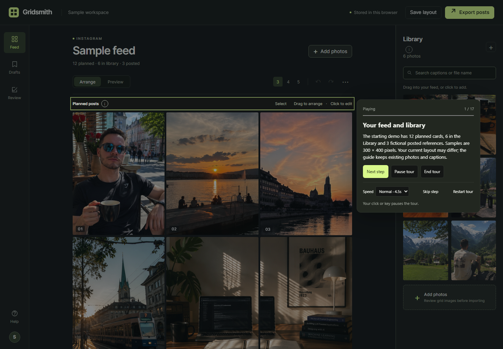
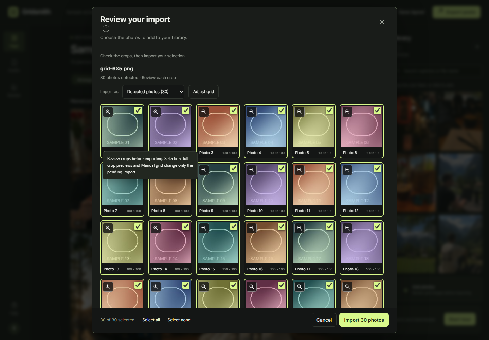

# A five-minute sample demo

Open the [web demo](https://ademord.github.io/gridsmith/) or download [gridsmith-demo.html](https://github.com/Ademord/gridsmith/releases/download/v1.1.1/gridsmith-demo.html). For a local checkout, run `npm run serve` and use the printed localhost URL. The offline HTML opens directly in a browser.

In a fresh browser context, the workspace begins with 12 planned images and six library images approved for this demo, plus three fictional abstract posted references. The 18 approved images are previously unposted generated images, resized to 300 × 400 with metadata removed. Actual posted photos are excluded. Your browser may restore an arrangement you previously saved at the same address.

Select **Start tour** for a 17-step walkthrough anchored to the live controls. Next step advances explicitly, Pause tour stops timed progression, and End tour keeps your current work. The tour moves a bundled sample card and fills only its blank caption/date fields. Import confirmation and downloads always wait for you. Existing text is preserved; editing a field pauses the guide. Restart tour returns the guide to its first step without resetting the layout.

Select **Try a grid import** above the feed to explore manually. It opens the real review dialog with an embedded generated 4 × 4 grid, including when the HTML is copied elsewhere and opened offline. It does not start the tour or add photos. Choose which crops to keep, inspect and adjust them, then select Import yourself or Cancel. Closing the review returns keyboard focus to its entry control. Existing photos, captions, selections and drafts stay in place.

The invitation scrolls with the feed so it leaves the Library accessible. Dismiss it with the × button when you want more space. **Help** always offers **Start tour** and **Try a grid import**. Dismissal is a separate browser preference; it stays through reload and tour exit without changing your layout. If preference storage is blocked, it lasts for the current visit.



For a manual demonstration:

1. **Arrange:** click a library card to put it at the top. Focus a planned card and press Alt + Right to move it one position. Undo and redo the change.
2. **Edit:** open a planned card, enter a sample caption and date, then close the preview. Dates are notes, not scheduled publishing.
3. **Draft:** open Drafts, save “Sample launch”, change the arrangement, then load the draft to restore it.
4. **Review an import:** select **Try a grid import** to review 16 generated crops without finding a local file. Try Select none, select a few crops and view one at full preview size. Cancel once to see that nothing is added. A checkout also includes `tests/fixtures/grid-6x5.png` for a 30-crop example.
5. **Correct the grid:** select **Try a grid import** again, choose Adjust grid, edit rows/columns/gutter, then Apply grid. Import stays unavailable until pending grid changes are applied. Choose “Original as one photo” to keep the whole image instead.
6. **Keep the result:** confirm the selection, reload, and check the imported cards in the library. Save layout downloads a JSON backup; add that file to restore it.
7. **Export:** Export posts downloads numbered JPEGs, `manifest.json`, `captions.csv`, and a readme. Bundled samples stay at their actual 300 × 400 pixels; the export does not enlarge them or include full-size originals. `sample: true` and `demo-sample-preview` identify them. The three generated posted references also have `fictionalReference: true`; their `posted` status describes planner placement, not real publication. Library items are excluded; posted references are included at the end.
8. **Appearance:** use More feed options → Theme to try all four themes. Try a 390- or 320-pixel viewport and the import dialog's selection and confirmation controls.



## Reproduce screenshots and checks

Follow the dependency setup in [README.md](README.md), then run:

```sh
python tools/build.py --check
npm test
npm run screenshots
```

The screenshot script uses only the approved demo samples and synthetic collage fixtures in fresh browser contexts. It writes desktop, light theme, import review and mobile images to `docs/images/`. The test run writes its own evidence to ignored `test-results/`; a screenshot alone does not establish a passing test.
