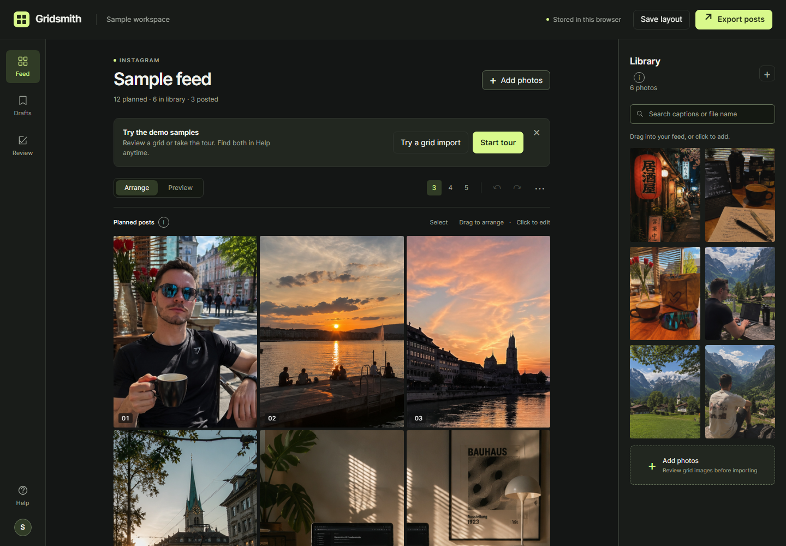

# Gridsmith

A feed planner that keeps your photos and layouts in your browser. Arrange a grid, review crops from a collage, save named drafts, and download your posts in order. Dates are planning notes; Gridsmith does not publish to Instagram.

[Source](https://github.com/Ademord/gridsmith) | [Live demo](https://ademord.github.io/gridsmith/) | [Download the offline demo](https://github.com/Ademord/gridsmith/releases/download/v1.1.1/gridsmith-demo.html) | [Checks](https://github.com/Ademord/gridsmith/actions/workflows/ci.yml)

The web demo, offline HTML and local preview use the same standalone app. Your own imports stay in your browser.



The demo starts with **12 planned images, six library images and three posted references**. The first 18 images are owner-approved, previously unposted generated images, published as 300 x 400 PNGs with metadata removed. The three abstract posted references are fictional. Actual posted photos and saved personal workspaces are excluded.

Select **Try a grid import** to review a built-in collage, **Start tour** for the walkthrough, or arrange the samples yourself. Dismiss the invitation for more space; both options remain in **Help**. The [demo guide](DEMO-GUIDE.md) covers both paths.

## Try it locally

Open the downloaded `gridsmith-demo.html` or the checkout's `demo/index.html` in a modern browser. To serve the checkout locally with Node.js 24:

```sh
npm run serve
```

Visit the localhost address printed by the server. The app has no account, backend, analytics, or external asset dependencies. Browser storage belongs to the current origin. Use **Save layout** before changing browsers, clearing storage, or moving between a local file and a hosted site.

## What you can do

- Drag photos into order, use Alt + arrow keys, or select several posts together.
- Review detected crops before importing. Flat gutters can separate unequal tiles, mixed rows, wide gaps and partial rows. Select the photos you want, inspect their edges, correct an equal grid, or keep the original intact. Ambiguous layouts need review; detection is not a guarantee.
- Add captions and dates, keep up to ten named drafts, and undo or redo changes.
- Switch among Charcoal, Violet, Amber and Light themes; preview the profile grid.
- Save a JSON backup including imported photos. Add the backup through **Add photos** to restore it.
- Export a ZIP with numbered JPEGs, captions, dates, and an image manifest that records actual dimensions and source quality.

Posted reference cards stay at the end of the feed. ZIP exports include them and exclude the library. The included sample cards are 300 x 400 pixels; exporting does not create higher resolution originals.

See [the short demo guide](DEMO-GUIDE.md) and [storage and security notes](SECURITY.md).

**Start tour** opens a 17-step guided demo over the real planner controls. It moves one bundled sample card and fills its blank caption/date fields. The guide waits for you to confirm imports, save drafts, choose themes, or start downloads. Your clicks and edits pause the tour; End tour preserves the work already done.

## Build and verify

Use Python 3.12 and Node.js 24. From a clean checkout:

```sh
python -m venv .venv
# Activate .venv using your platform's normal command.
python -m pip install -r requirements.txt
npm ci
npx playwright install chromium firefox webkit
python tools/build.py --check
npm test
```

On Linux, `npx playwright install --with-deps chromium firefox webkit` also installs system browser dependencies. The exact Pillow and Playwright versions are pinned. `npm test` starts and stops its own loopback server and uses fresh browser contexts. It writes JSON evidence and failure screenshots under ignored `test-results/`.

The tests exercise known 16- and 30-photo grids, independently defined irregular crops, native pixel comparisons, single-image negatives, cancellation, original bytes, import persistence, backup restoration, retryable Undo/Redo under storage failure, drafts, ZIP contents, all themes, keyboard controls, narrow layouts and the guided/manual demos. Release canaries exercise changed images, stale inventories, secret patterns, history, symlinks and misleading approval records.

Run the browser suite once per engine (set environment variables using your shell):

```sh
PLAYWRIGHT_BROWSER=chromium npm test
PLAYWRIGHT_BROWSER=firefox npm test
PLAYWRIGHT_BROWSER=webkit npm test
```

PowerShell uses `$env:PLAYWRIGHT_BROWSER = 'firefox'` followed by `npm test`. CI runs all three engines. These are desktop engine and simulated-viewport checks, not tests on physical phones or Safari itself. Firefox uses narrow viewports with touch because its driver does not support mobile emulation. Copied-file tests deny network access; WebKit on Windows uses request blocking because its offline-emulation flag rejects local file navigation. Evidence records the method and actual engine version.

After editing `planner_src/`, regenerate the standalone page and fixtures:

```sh
python tools/build.py
python tools/build.py --check
npm test
npm run screenshots
```

`tools/build.py` uses the 18 approved PNGs in `assets/` and bundles the standalone `demo/index.html`. Generated reference cards and collage fixtures use canonical PNG bytes, checked against fixed hashes and exact generated pixels, to preserve the same output across platforms. It does not need the original image collection or a saved workspace. Screenshot capture uses fresh demo contexts and writes `docs/images/`.

For an existing local browser installation, set `PLAYWRIGHT_CHANNEL` (for example `msedge`) or `PLAYWRIGHT_CHROMIUM_EXECUTABLE_PATH`. A configured runtime can use `PLAYWRIGHT_MODULE`; ordinary installs need no overrides.

## Update or recover

Before updating, use **Save layout** to download a backup. In your existing checkout:

```sh
git pull --ff-only
python -m pip install -r requirements.txt
npm ci
python tools/build.py --check
```

Reload the planner at the same address. Stored photos and layouts remain in that browser. If the update fails, keep your backup and use the previous release's standalone HTML. A different file or address may have separate browser storage; restore the backup through **Add photos**. Do not clear browser storage as an update step.

If storage is blocked or full, **Unsaved changes** appears in the header and notifications include backup advice. Download the layout before reloading, free storage or allow storage for the site, then restore the backup. An unsuccessful photo import stays open so you can retry or cancel.

## Continuous integration and hosting

[Browser and release checks](.github/workflows/ci.yml) verify the exact inventory, image policy, reachable history and generated page, and run Chromium, Firefox and WebKit cases. The [Publish sample demo](.github/workflows/pages.yml) workflow reuses those checks and uploads only `demo/`. Releases record the tested source commit, workflow runs and downloaded/hosted artifact hashes.

The exact source snapshot and assets are inventoried in [PUBLIC-CONTENTS.json](PUBLIC-CONTENTS.json). Both inventory and verification tools are in this repository. See the [review records](docs/VALIDATION.md), [release instructions](docs/RELEASE.md) and [review rules](docs/GOVERNANCE.md); refreshing a hash is not approval.

See [the handoff](HANDOFF.md) for current scope and [remaining work](TODO.md) for open tasks.
